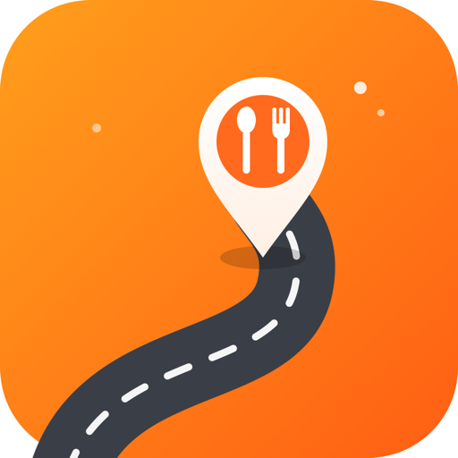

# 오다가다 (Odagada)

**운전 중, 지나는 길에 발견하는 맛집 추천 앱**

---

## 서비스 소개

**오다가다**는 운전 중 차량의 실시간 위치를 기준으로 **주변 맛집을 자동으로 추천**해 지도 위 핀으로 보여주는 모바일 앱입니다. 운전자는 별도 조작 없이도 진행 방향 앞쪽에 있는 맛집을 지도에서 바로 확인하고, 핀을 한 번 탭하면 길찾기로 이어집니다.

> "목적지를 정하고 찾아가는" 기존 지도 앱과 달리, 오다가다는 **가는 길에 좋은 곳을 우연히 발견하게** 해줍니다.

## 주요 기능

- 🚗 **주행 중 자동 추천** — 일정 거리(약 200m)를 이동할 때마다 주변 맛집 핀이 자동으로 갱신됩니다. 운전 중 조작이 필요 없습니다.
- 🧭 **진행 방향 우선** — 이미 지나친 곳이 아니라, 차량이 향하는 **전방의 맛집**을 우선해서 보여줍니다.
- 📍 **지도 + 핀 + 정보 카드** — 핀을 탭하면 가게 이름·거리·카테고리를 확인하고, **길찾기** 버튼으로 카카오맵/내비 길안내에 연결됩니다.
- 🧩 **모듈형 확장 구조** — 맛집은 첫 번째 "주변 정보 모듈"이며, 향후 부동산 시세·골프장 정보 등을 켜고 끌 수 있도록 설계되었습니다.

## 사용 기술

| 구분 | 기술 |
|---|---|
| 앱 프레임워크 | Flutter (iOS / Android 단일 코드베이스) |
| 지도 | 카카오맵 (JavaScript SDK) |
| 장소 데이터 | 카카오 로컬 REST API (음식점 카테고리 `FD6`) |
| 길찾기 | 카카오맵 / 카카오내비 딥링크 |
| 위치 | 기기 GPS (거리 기반 갱신) |

## 카카오 API 활용

- **카카오 로컬 API** — 차량 좌표 주변의 음식점을 카테고리·반경으로 검색합니다.
- **카카오맵** — 지도 렌더링, 내 위치 추적, 추천 핀 표시에 사용합니다.
- **길찾기 딥링크** — 선택한 맛집으로의 경로 안내를 카카오맵/내비 앱에 연결합니다.

## 개발 현황

현재 **MVP(맛집 모듈) 개발이 완료**되었으며, 실기기 검증 및 스토어 배포를 준비 중입니다.

## 안전 고려사항 (운전 중 사용)

기본 상호작용은 **조작이 필요 없도록**(핀 자동 갱신) 설계되었습니다. 자동 팝업·연쇄 모달을 배제하고, 상세 정보는 사용자가 직접 탭했을 때만 표시하여 운전 중 화면 주시를 최소화합니다.

---

© 2026 Goodbug S/W · 오다가다 (Odagada)

